# Real-Time Human Joint Angle Tracking and Control

Bu proje, insan eklem açılarını gerçek zamanlı olarak izleyen ve referans egzersiz hareketleriyle karşılaştıran bir PyQt5 masaüstü uygulamasıdır.

Bu doküman, proje hakkında hızlı ve net bilgi verecek şekilde yapılandırılmıştır.
- `##` başlıkları, ana bölümleri temsil eder.
- `###` başlıkları, ilgili bölümün alt adımlarını açıklar.
- Metin ve görseller birlikte kullanılarak hem teknik hem görsel bir anlatım sunulur.

## 1. Projenin Amacı
- Kamera akışı üzerinden insan pozu algılanır (MediaPipe Pose).
- Omuz, dirsek, kalça, diz ve ayak bileği dahil çoklu eklem açıları hesaplanır.
- Referans hareket görselleri ile canlı hareket, tolerans aralığında karşılaştırılır.
- Kullanıcıya egzersiz, profil, yardım ve ilerleme raporu ekranları sunulur.

## 2. Teknoloji Yığını ve Gerekçesi
- Python 3
- PyQt5
- OpenCV
- MediaPipe
- NumPy

Bu teknoloji seti, masaüstü arayüz geliştirme hızını ve gerçek zamanlı görüntü işleme performansını birlikte sağlamak amacıyla seçilmiştir.

## 3. Uygulama Akışı
1. Giriş ekranı açılır.
2. Ana menüden ilgili modül seçilir.
3. Egzersiz ekranında referans pozlar sırayla gösterilir.
4. Kamera akışı üzerinden açı karşılaştırması yapılır.
5. Sonuçlar ilerleme raporuna yansıtılır.

## 4. Geliştirme Süreci

### Adım 1: Proje sürümünün belirlenmesi
- Workspace içindeki kopyalar arasından aktif ve en güncel sürüm seçildi.
- Çalışma dizini: New folder/StajProjesiiii

### Adım 2: Windows uyumluluğu düzeltmeleri
- `subprocess.Popen(["python3", ...])` kullanımları `subprocess.Popen([sys.executable, ...])` olarak güncellendi.
- Böylece Windows ortamında komut çağrıları güvenli hale getirildi.

### Adım 3: Görsel klasör yapısının düzenlenmesi
- Arka plan görselleri `resimler/` altında alt klasörlere ayrıldı.
- Kod içindeki görsel yolları yeni klasör yapısına göre güncellendi.

### Adım 4: Dokümantasyon görsellerinin ayrıştırılması
- Ekran görüntüleri `Görüntüler/` altında konu bazlı klasörlere taşındı.
- README görsel referansları bu yeni yapıya göre güncellendi.

### Adım 5: README genişletme
- Kurulum, çalıştırma, teknik detaylar ve sorun giderme alanları genişletildi.
- Bu sürümde kullanıcıya ait daha fazla görüntü, küçük görseller halinde eklendi.

## 5. Kurulum Rehberi

### 5.1 kurulum
```bash
python --version
```
Python 3.7 veya üzeri önerilir.

### 5.2 Depoyu çekme
```bash
git clone https://github.com/Hasanmercann/Human-Joint-Angle-Tracking.git
cd Human-Joint-Angle-Tracking
```

### 5.3 Bağımlılıkları kurma
```bash
pip install pyqt5 opencv-python mediapipe numpy
```

### 5.4 Kurulumu doğrulama
```bash
python -c "import cv2, mediapipe, PyQt5, numpy; print('Kurulum tamam')"
```

## 6. Uygulamayı Başlatma

### Giriş ekranı ile başlatma
```bash
python p_login.py
```

### Ana menüden başlatma
```bash
python start_menu.py
```

### Doğrudan takip ekranı
```bash
python main.py
```

## 7. Demo Giriş Bilgisi
- Kullanıcı adı: hasan
- Şifre: 12345

Bu hesap yalnızca test amaçlıdır ve uygulamanın ilk kurulum/doğrulama adımlarını hızlandırmak için paylaşılmıştır.

## 8. Ekran Görüntüleri

Bu bölümde uygulama arayüzleri ve geliştirme sürecinde alınan gerçek ekran görüntüleri bir arada sunulmaktadır.

### Temel Uygulama Ekranları
Giriş, ana menü, yardım ve rapor ekranlarının genel görünümü:
<p>
  
  
  
  
</p>

### Egzersiz modülündeki hareket seçimi ve takip ekranları:
<p>
  
  
  
</p>

### Kullanıcı üzerindeki işaretlemelerin görüldüğü kareler (pose takibi doğrulama örnekleri):
<p>
  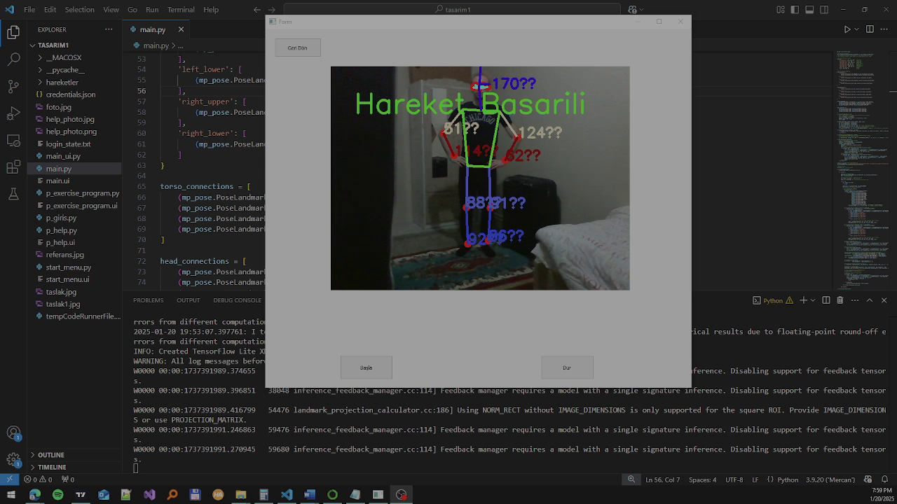
  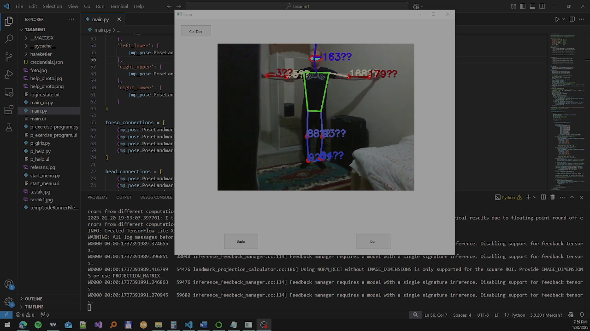
  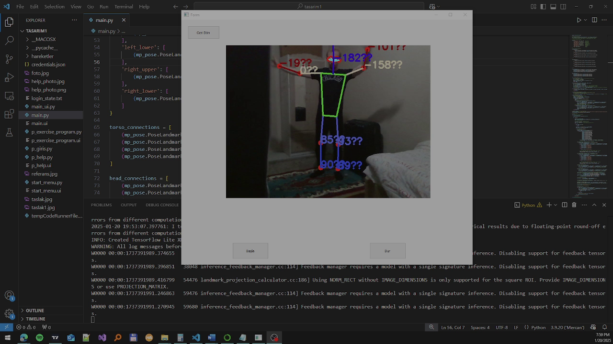
  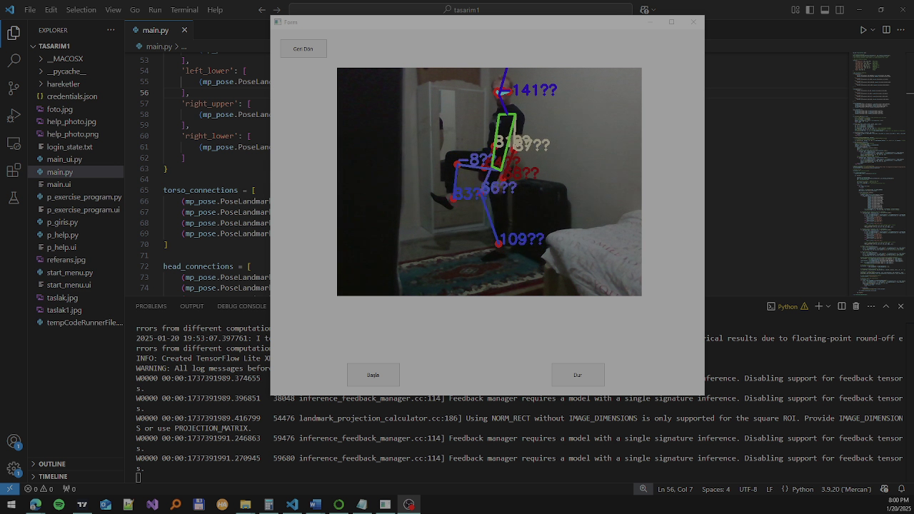
  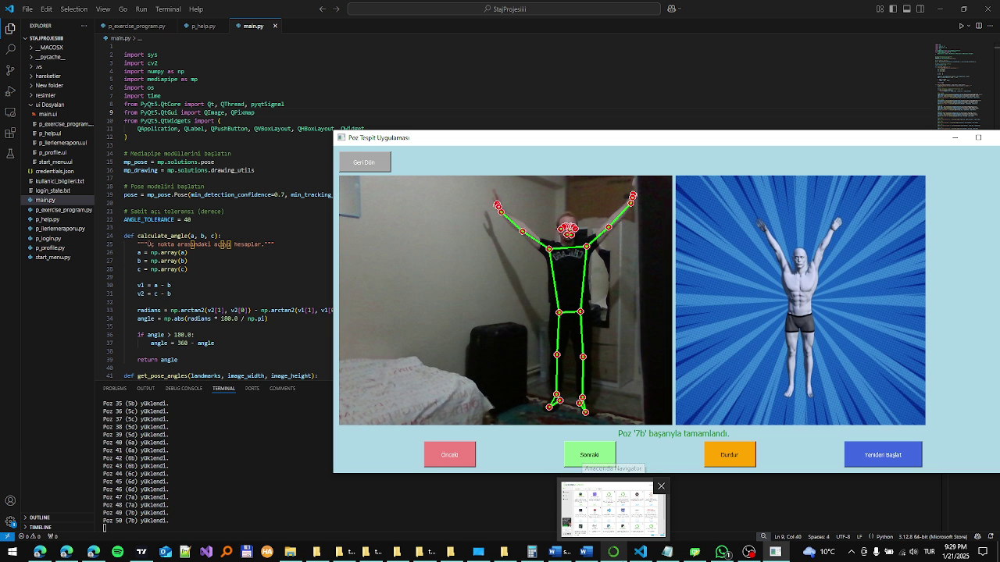
  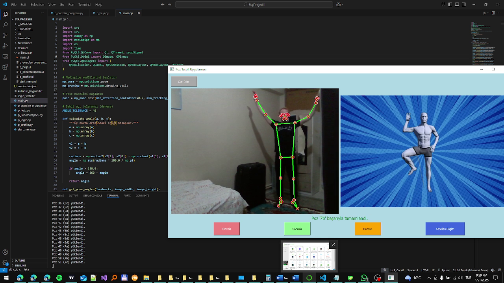
</p>

### Python kurulumu, sürüm kontrolü ve ortam doğrulamasına ait ekran görüntüleri:
<p>
  
  
  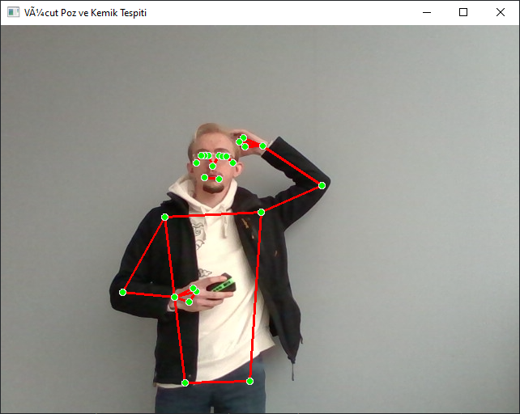
</p>

### Kurulum adımları ve araç ekranlarına ait örnekler:
<p>
  
  
  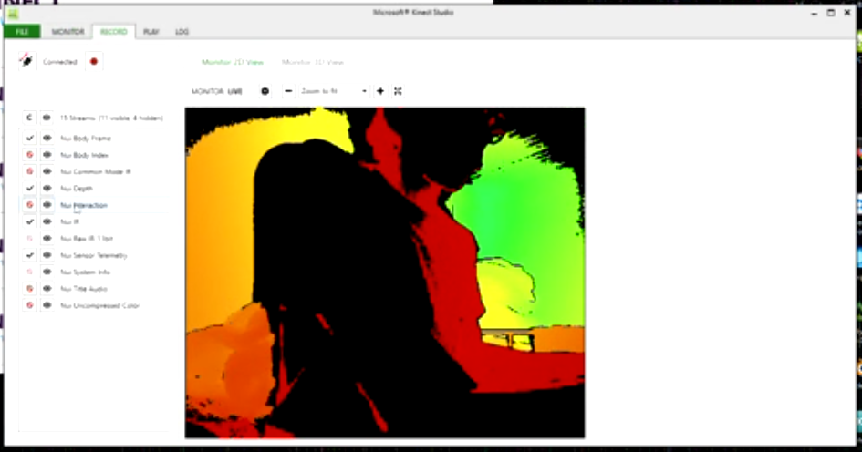
</p>

### Proje sürecinden kalan destekleyici ek görüntüler:
<p>
  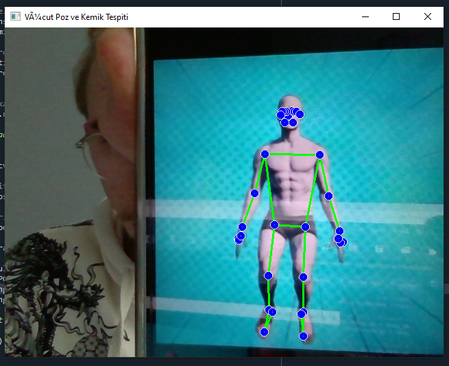
  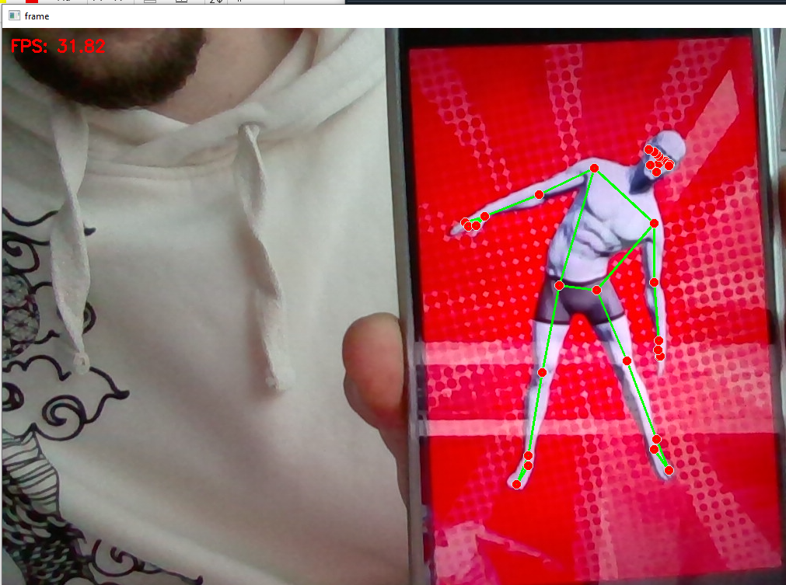
  
  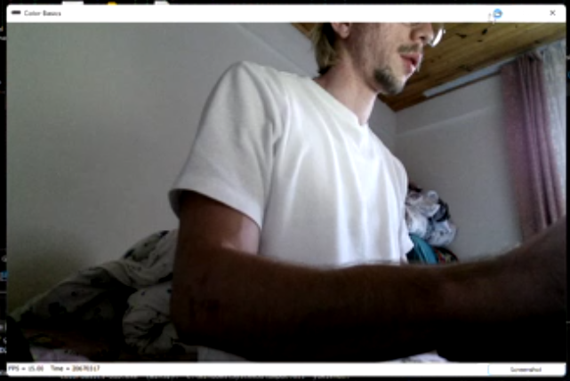
  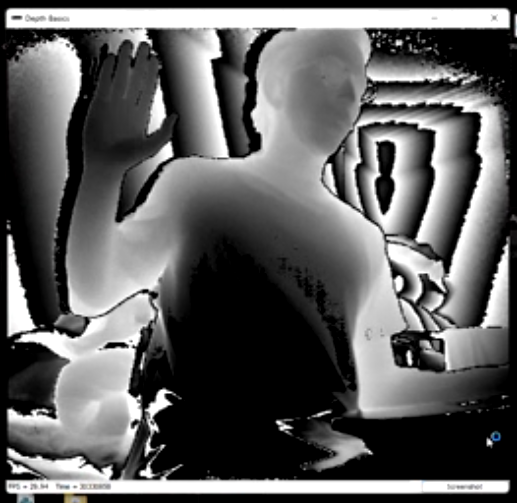
  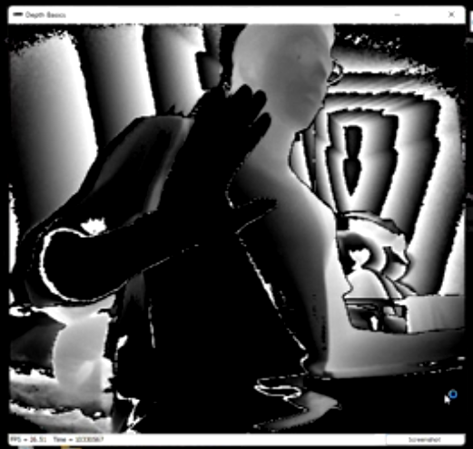
</p>

## 9. Teknik Parametreler
- Referans hareket klasörü: `hareketler/`
- Açı toleransı: 40 derece
- Pose confidence: 0.7
- İşletim sistemi testi: Windows

## 10. Sorun Giderme

### pyqt5 modülü bulunamadı
```bash
pip install --upgrade pyqt5
```

### Kamera açılmıyor
- Kamera izinlerini kontrol et.
- Başka uygulamaların kamerayı kullanmadığından emin ol.

### Görseller görünmüyor
- `Görüntüler/` ve `resimler/` klasör yapısının bozulmadığını doğrula.

## 11. Klasör Yapısı (Özet)
```text
Human-Joint-Angle-Tracking/
  start_menu.py
  p_login.py
  main.py
  p_exercise_program.py
  p_profile.py
  p_help.py
  p_ilerlemeraporu.py
  hareketler/
  resimler/
  Görüntüler/
```
